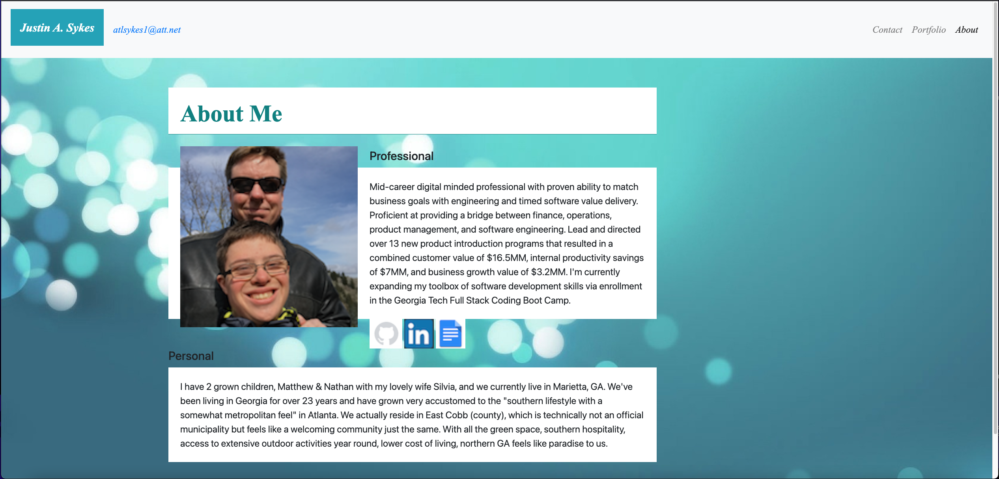

Justin-Sykes-Portfolio

3 webpages that comprise my personal portfolio. These pages have been coded to be mobile-responsive such that they will appear asthetically pleasing at resolutions of 400px, 768px, and 992px wide. Bootstrap CDN has been leveraged to generate navbars with collapsible togglers and bootstrap grids for an appropriate layout on each page.

URL of deployed app: https://204039643.github.io/Justin-Sykes-Portfolio/

- [Installation](#installation)
- [Usage](#usage)
- [Credits](#credits)
- [License](#license)

## Installation

Fork and/or clone my GitHub repository to your local machine: https://github.com/204039643/Justin-Sykes-Portfolio

## Usage

1. Open in your web browser, either on a PC or mobile device: https://204039643.github.io/Justin-Sykes-Portfolio/
2. Using the Navbar, select which page to interest view: About, Portfolio, Contact.
3. On the Portfolio page, I've included 4 recent projects that I've completed personally or were a team member. Click the image to view the respective web app in a new window (tab). Also included are links to respective GitHub repository.
4. Adjust width of browser window to observe how each pages is responsive in order to accommodate mobile viewports.

## Credits

- W3C Schools HTML semantics: https://www.w3schools.com/html/html5_semantic_elements.asp
- Bootstrap CDN: https://getbootstrap.com/docs/4.5/getting-started/introduction/

## License

MIT License

Copyright (c) [2020] [Justin Sykes]

Permission is hereby granted, free of charge, to any person obtaining a copy
of this software and associated documentation files (the "Software"), to deal
in the Software without restriction, including without limitation the rights
to use, copy, modify, merge, publish, distribute, sublicense, and/or sell
copies of the Software, and to permit persons to whom the Software is
furnished to do so, subject to the following conditions:

The above copyright notice and this permission notice shall be included in all
copies or substantial portions of the Software.

THE SOFTWARE IS PROVIDED "AS IS", WITHOUT WARRANTY OF ANY KIND, EXPRESS OR
IMPLIED, INCLUDING BUT NOT LIMITED TO THE WARRANTIES OF MERCHANTABILITY,
FITNESS FOR A PARTICULAR PURPOSE AND NONINFRINGEMENT. IN NO EVENT SHALL THE
AUTHORS OR COPYRIGHT HOLDERS BE LIABLE FOR ANY CLAIM, DAMAGES OR OTHER
LIABILITY, WHETHER IN AN ACTION OF CONTRACT, TORT OR OTHERWISE, ARISING FROM,
OUT OF OR IN CONNECTION WITH THE SOFTWARE OR THE USE OR OTHER DEALINGS IN THE
SOFTWARE.
